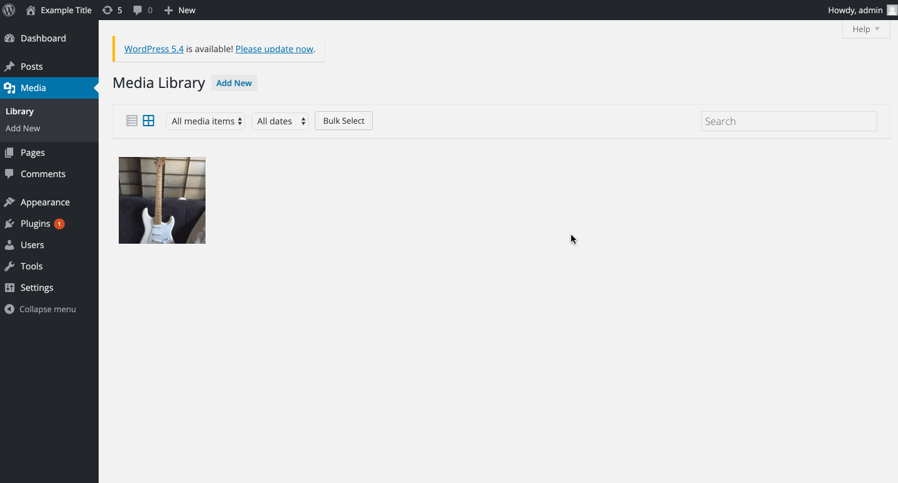

# Project 7 - WordPress Pentesting

Time spent: **4** hours spent in total

> Objective: Find, analyze, recreate, and document **five vulnerabilities** affecting an old version of WordPress

## Pentesting Report

**1. Authenticated Stored Cross Site Scripting (XSS)**
  - Summary: 
    - Vulnerability types: Cross Site Scripting (XSS)
    - Tested in version 4.2
    - Fixed in version: 4.2.3
  - GIF Walkthrough:
  
  - **Steps to recreate:** 
	- Create a new post
	- Insert the following script tag into the body of the post:

    		<script>alert('xss')</script>

	- Publish the post
	- View the post

**2. Authenticated Stored Cross Site Scripting via Image Frame**
  - Summary: 
    - Vulnerability types: Cross Site Scripting (XSS)
    - Tested in version: 4.2
    - Fixed in version: 4.2.1
  - GIF Walkthrough:
  
  - Steps to recreate:
	- Add or update an image to media
	- Click on the image then edit more details
	- Add the following tag to the image name in the title section:
	
		``````
	
	- Click update and open the permalink

**3. Brute Force User Authentication**
  - Summary: 
    - Vulnerability types: User Authentication
    - Tested in version: 4.2
    - Fixed in version: N/A
  - GIF Walkthrough:
  
  - Steps to recreate:
	- Upon trying to login, typing in 'admin' for the username with an incorrect password provides information that an 'admin' account does exist, a potential key for hackers.


## Assets

List any additional assets, such as scripts or files

## Resources

- [WordPress Source Browser](https://core.trac.wordpress.org/browser/)
- [WordPress Developer Reference](https://developer.wordpress.org/reference/)

GIFs created with [LiceCap](http://www.cockos.com/licecap/).

## Notes

Describe any challenges encountered while doing the work

## License

    Copyright 2020 Jorge Quiroz

    Licensed under the Apache License, Version 2.0 (the "License");
    you may not use this file except in compliance with the License.
    You may obtain a copy of the License at

        http://www.apache.org/licenses/LICENSE-2.0

    Unless required by applicable law or agreed to in writing, software
    distributed under the License is distributed on an "AS IS" BASIS,
    WITHOUT WARRANTIES OR CONDITIONS OF ANY KIND, either express or implied.
    See the License for the specific language governing permissions and
    limitations under the License.
